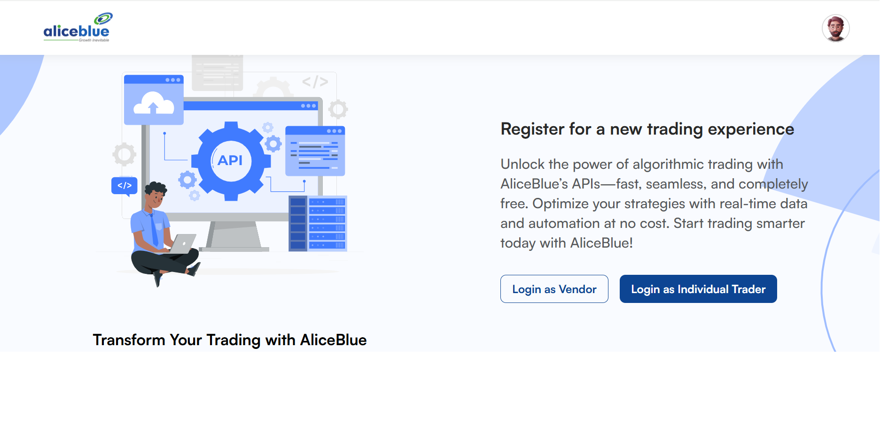
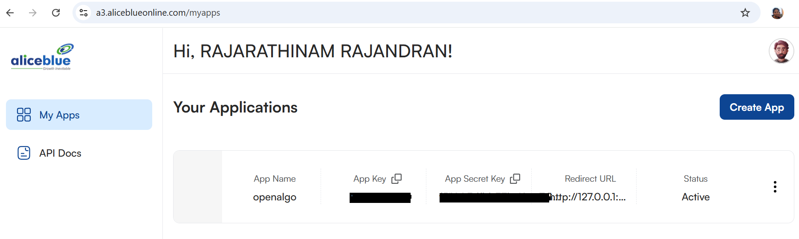
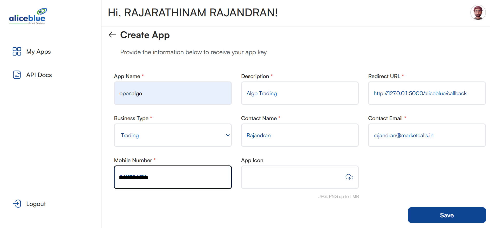
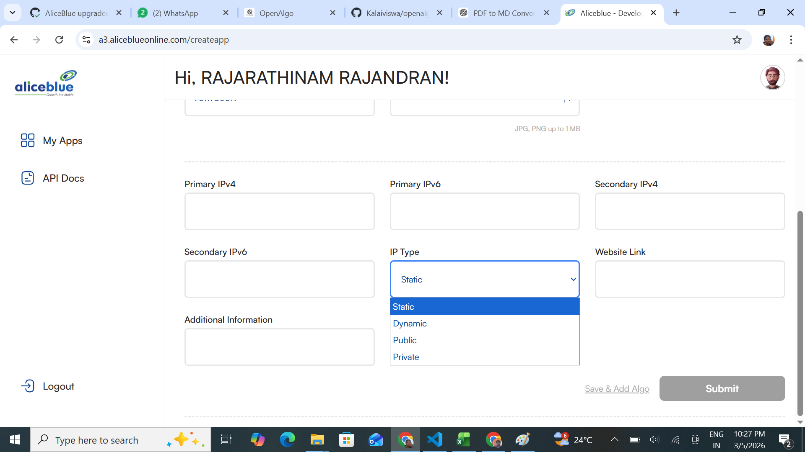
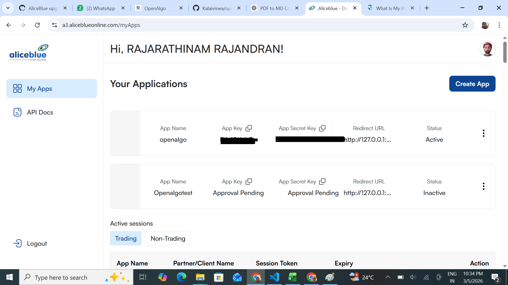

# AliceBlue

OpenAlgo provides seamless integration with AliceBlue, enabling you to connect your trading strategies with AliceBlue’s brokerage services. Follow this guide to set up your AliceBlue broker account with OpenAlgo.



### Prerequisites

Before proceeding, ensure you have the following:

* An active AliceBlue trading account.
* Access to the AliceBlue ANT website.
* OpenAlgo installed and configured on your local machine.

### Steps to Create the AliceBlue API Secret Key

<figure><figcaption></figcaption></figure>

1. **To register as a Individual trader/Vendor,**
   * Navigate to the [https://a3.aliceblueonline.com/](https://a3.aliceblueonline.com/)
   * Select **Login as Individual Trader**
   * Enter your credentials to log in.

<figure><figcaption></figcaption></figure>

2. **Access My Apps**

* On the top right corner, click on **Create App**.

<figure><figcaption></figcaption></figure>

* Fill up the Mandatory Fields.
* Save it

<figure><figcaption></figcaption></figure>

* Fill up the Ip address , select the IP Type from the drop down and submit it.

<figure><figcaption></figcaption></figure>

1. **Generate API Key**
   * If you don’t already have an API key, generate a new one by following the on-screen instructions.
   * Note down the **API Secret Key** as it will be required for configuring the `.env` file.

### Configuring the `.env` File

The AliceBlue login user ID is used as the API key. Below is a sample configuration for the `.env` file:

```
# AliceBlue Broker Configuration
BROKER_API_KEY = 'your_api_key'
BROKER_API_SECRET = 'your_api_secret_here'
REDIRECT_URL = 'http://127.0.0.1:5000/aliceblue/callback'

```

Replace `your_client_id` with your AliceBlue login user ID and `your_api_secret_here` with the generated API secret key.

#### Important Notes

* Ensure that your **API Secret Key** is stored securely and is not shared publicly.
* The **REDIRECT\_URL** should match the one registered with your API application.

Follow these steps to integrate AliceBlue with OpenAlgo successfully. If you encounter any issues, refer to the AliceBlue API documentation for further assistance.

