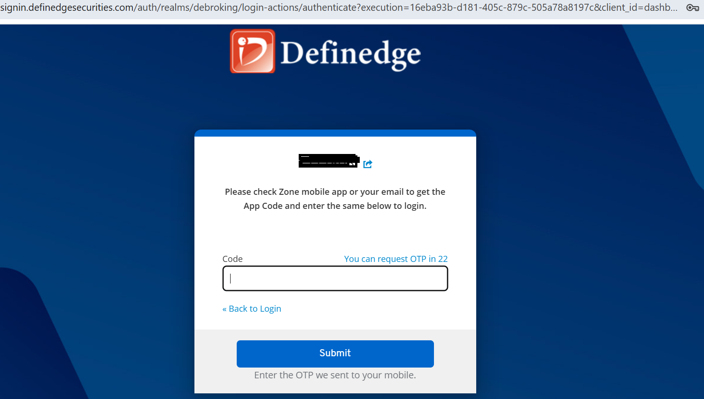
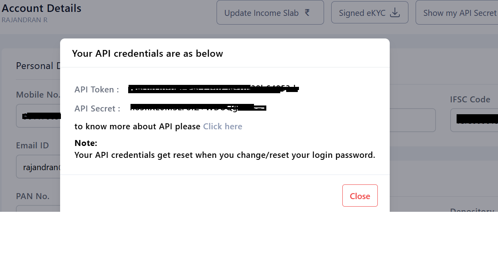

# Definedge

OpenAlgo provides seamless integration with Definedge Securities, enabling you to connect your trading strategies with Definedge’s brokerage services. Follow this guide to set up your Definedge broker account with OpenAlgo.

**Prerequisites**

Before proceeding, ensure you have the following:

* An active Definedge Securities trading account.
* Access to [Definedge Securities Portal](https://myaccount.definedgesecurities.com/).
* OpenAlgo installed and configured on your local machine.

### Steps to Create the Definedge API Secret Key

#### 1. Login to Definedge Securities Portal

* Navigate to [https://myaccount.definedgesecurities.com/](https://myaccount.definedgesecurities.com/).
* Enter your **UCC (Account ID)** and **password**.

<figure><figcaption></figcaption></figure>

* Complete TOTP authentication.

<figure><figcaption></figcaption></figure>

* This will take you to your dashboard.

#### 2. Access API Key Section

* From the dashboard, go to the **Account** section.
* Click on **Show my API Secret**.
* Here you will find your **API Token** and **API Secret**.

<figure><figcaption></figcaption></figure>

**Configuring the .env File**&#x20;

The Definedge API Token is used as the API key and API Secrets as API Secret itself. Below is a sample configuration for the .env file     &#x20;

\#Definedge Broker Configuration

```
# Definedge Broker Configuration
BROKER_API_KEY = 'your_API_Token_here'
BROKER_API_SECRET = 'your_API_Secret_here' 
REDIRECT_URL = 'http://127.0.0.1:5000/definedge/callback' 
```

**Important Notes**

* Ensure that your **API Secret Key and API Token** are stored securely and is not shared publicly.
* The **REDIRECT\_URL** should match the one registered with your API application.

Follow these steps to integrate Definedge with OpenAlgo successfully. If you encounter any issues, refer to the Definedge API documentation for further assistance.
