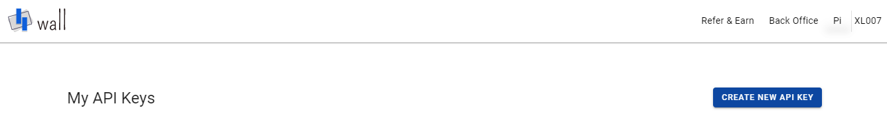

# FlatTrade

FlatTrade is an Indian discount broker recognized for its flat-fee brokerage model, which ensures cost-effective trading solutions for investors. The platform supports trading across multiple asset classes, including stocks, derivatives, and commodities, via its intuitive mobile and web applications. With features like real-time data feeds, customizable charting tools, and fast order execution, FlatTrade is designed to cater to traders seeking affordability without compromising on essential functionality.

## Getting API Credentials

To integrate Flattrade with OpenAlgo, follow these steps to obtain your API key and secret:

1\. Log in to Flattrade Wall

• Login to Wall [https://wall.flattrade.in](https://wall.flattrade.in/)

Enter your Shoonya login credentials.

2\. Navigate to Pi in top menu bar and click on “CREATE NEW API KEY”.

<figure><figcaption></figcaption></figure>

3.Click on Create the New API Key

<figure><figcaption></figcaption></figure>

4.Enter the Following Details in the Form

| App Name      | Your App Name                                                                                                                                            |
| ------------- | -------------------------------------------------------------------------------------------------------------------------------------------------------- |
| App ShortName | Short Name of your APP                                                                                                                                   |
| Redirect URL  | <p>URL to which we need to redirect after successful login authentication.<br>Note: Code to generate the token will be sent as parameter to this URL</p> |
| Postback URL  | URL to which you will be reciving order updates for the orders placed through API.                                                                       |
| Description   | Short description about your app                                                                                                                         |

5.Click on CREATE  button

6.Your API key is now generated

<figure><figcaption></figcaption></figure>

7.Copy the APIKEY

Click the eye icon  to view the API secret key. Copy API secret key

<figure><figcaption></figcaption></figure>

8\. Configure OpenAlgo:

• In your OpenAlgo .env file, set the following variables:

```bash
BROKER_API_KEY = 'client_id:::api_key'
BROKER_API_SECRET = 'api_secret'
REDIRECT_URL = 'http://127.0.0.1:5000/flattrade/callback'
```
