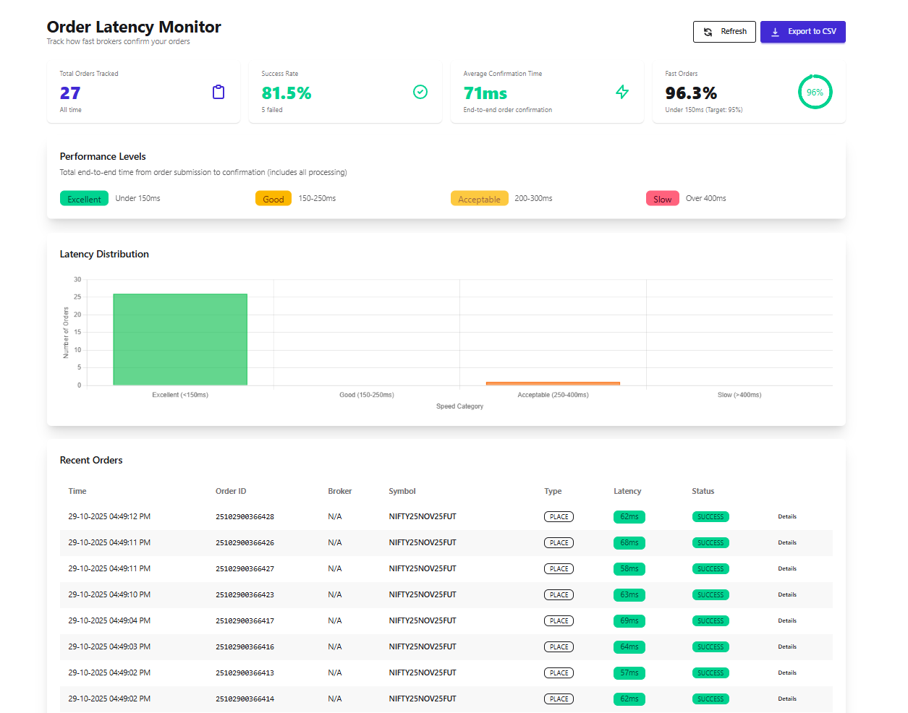

# Groww

<figure><figcaption></figcaption></figure>

#### Configuration:

Here is how you would typically set up your environment variables in a .env file for Groww's API:

```bash
BROKER_API_KEY = 'your_groww_clientid_here'
BROKER_API_SECRET = 'your_groww_token_here'
REDIRECT_URL = 'http://127.0.0.1:5000/groww/callback'
```

