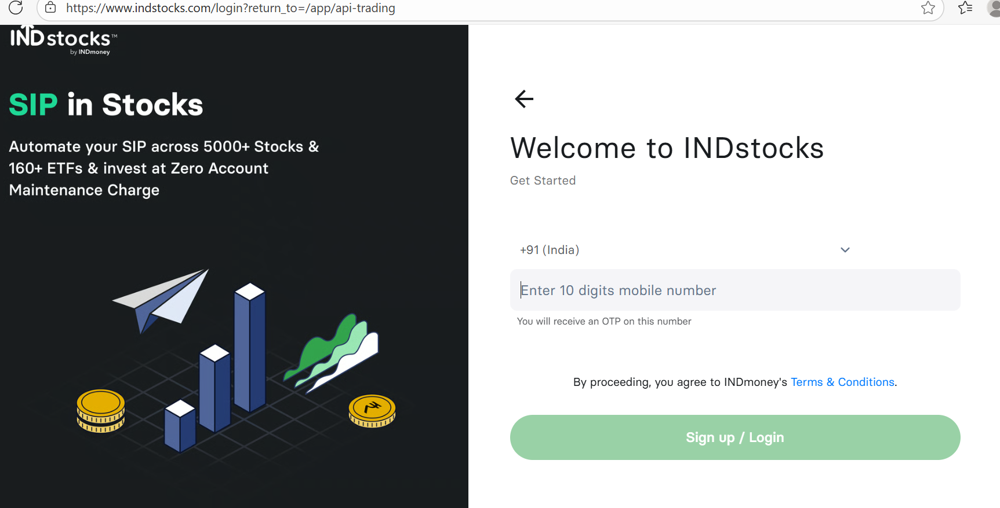
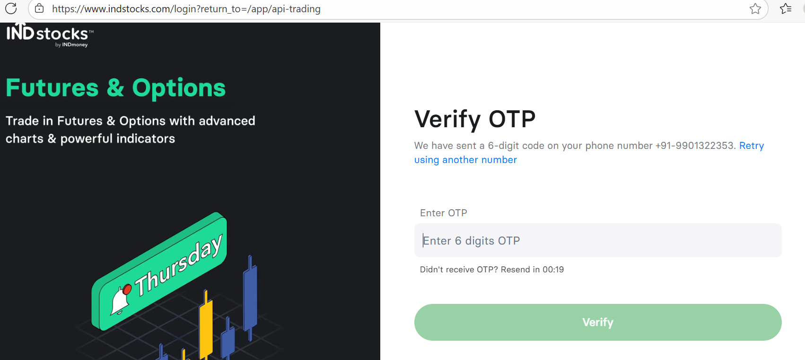
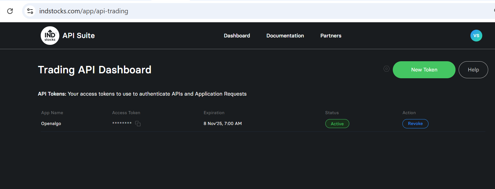
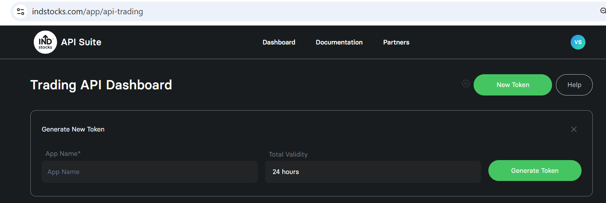
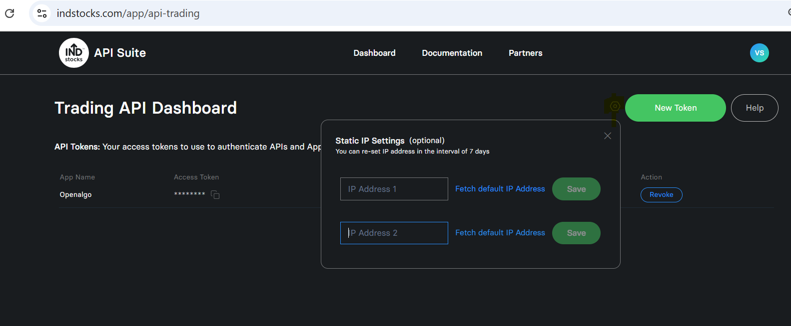

# IndMoney (INDstocks)

IndMoney (INDstocks) is a modern trading infrastructure platform offering APIs that allow traders and developers to build, automate, and execute trading strategies.\
Using IndMoney APIs, users can connect their IndMoney trading account with tools like **OpenAlgo** and create their own fully self-hosted, secure algo-trading setup.

### Steps for Integration

IndMoney uses a simple **Bearer Token** authentication model.

To generate a token:

Visit [**https://www.indstocks.com/app/api-trading**](https://www.indstocks.com/app/api-trading)

<figure><figcaption></figcaption></figure>

1. Enter your registered mobile number and login with the help of OTP

<figure><figcaption></figcaption></figure>

2. Open the **API Dashboard**

<figure><figcaption></figcaption></figure>

3. Click **New Token** and generate token

<figure><figcaption></figcaption></figure>

4. Copy the token shown on screen

This token will be used in OpenAlgo for all authenticated API requests.

**Note:**\
Tokens usually expire within **24 hours**. You must generate a fresh token when expired.

5. Setup static IP , by clicking small hexagon button next to New Token and save it.

<figure><figcaption></figcaption></figure>

### Environment Configuration

The generated access token is used as the API SECRET and keep the api key as empty. Below is a sample configuration for the `.env` file:

```
# Indmoney Broker Configuration
BROKER_API_KEY = ''
BROKER_API_SECRET = 'your_generated_access_token'
REDIRECT_URL = 'http://127.0.0.1:5000/indmoney/callback'
```

Integrating OpenAlgo with Indmoney's API opens up possibilities for automated trading strategies, providing a powerful tool for traders and developers to exploit market opportunities efficiently. It's essential to follow best practices for API integration, including handling rate limits, managing API keys securely, and ensuring robust error handling and logging mechanisms are in place.
