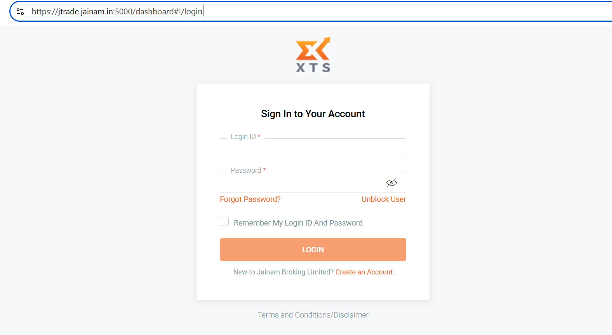

# JainamXTS

### **Jainam XTS Broker Integration**

OpenAlgo makes algorithmic trading accessible and straightforward by providing seamless integration with various brokers, including JainamXTS API. This documentation will guide you through the process of configuring your jainamxts account to work with OpenAlgo

#### **Step 1: Create API Applications**

Login to [https://jtrade.jainam.in:5000/dashboard#!/login](https://jtrade.jainam.in:5000/dashboard#!/login)

<figure><figcaption></figcaption></figure>

Once logged in:

1. Go to `My App` > `Create New Application`
2. Create two separate apps:

* **Interactive Order API**
* **Market Data API**

<figure><figcaption></figcaption></figure>

**Details to Fill:**

* **App Name**: OpenAlgo
* **App Description**: OpenAlgo
* **Redirect URL: (leave it empty)**
* **Company Name**: OpenAlgo (or your own)
* Choose the correct **API Package** depending on the app (Order or Market Data).

<figure><figcaption></figcaption></figure>

Once submitted, wait for approval from the broker. After approval, the status will turn **Active**.

#### Step 2: Setup Environment Variables <a href="#step-2-setup-environment-variables" id="step-2-setup-environment-variables"></a>

Refer to the `.sample.env` file in your OpenAlgo folder and prepare your `.env` as follows:

```
# Broker Configuration
BROKER_API_KEY = 'YOUR_BROKER_ORDER_API_KEY'
BROKER_API_SECRET = 'YOUR_ORDER_API_SECRET'

BROKER_API_KEY_MARKET = 'YOUR_BROKER_MARKET_API_KEY'
BROKER_API_SECRET_MARKET = 'YOUR_BROKER_MARKET_API_SECRET'

REDIRECT_URL = 'http://127.0.0.1:5000/jainamxts/callback'
```

Replace the values with actual credentials shown on your developer dashboard once approved.

#### **Step 3: Start OpenAlgo**

Once all environment variables are set and your apps are **Active**, you can now start OpenAlgo.

This completes the integration process for JainamXTS API with OpenAlgo.

By following the steps outlined in this guide, you have successfully configured your JainamXTS API account for use with OpenAlgo. You can now leverage the power of algorithmic trading to enhance your trading strategies and make data-driven decisions. Should you encounter any issues or need further assistance, please refer to the OpenAlgo community or support resources. Happy trading!
