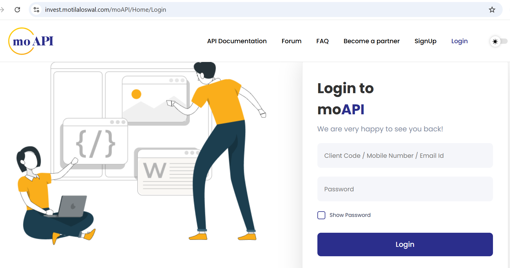
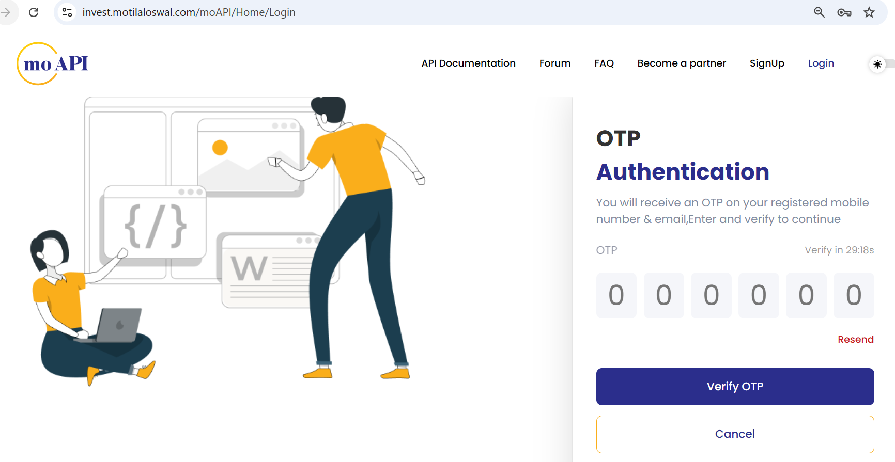
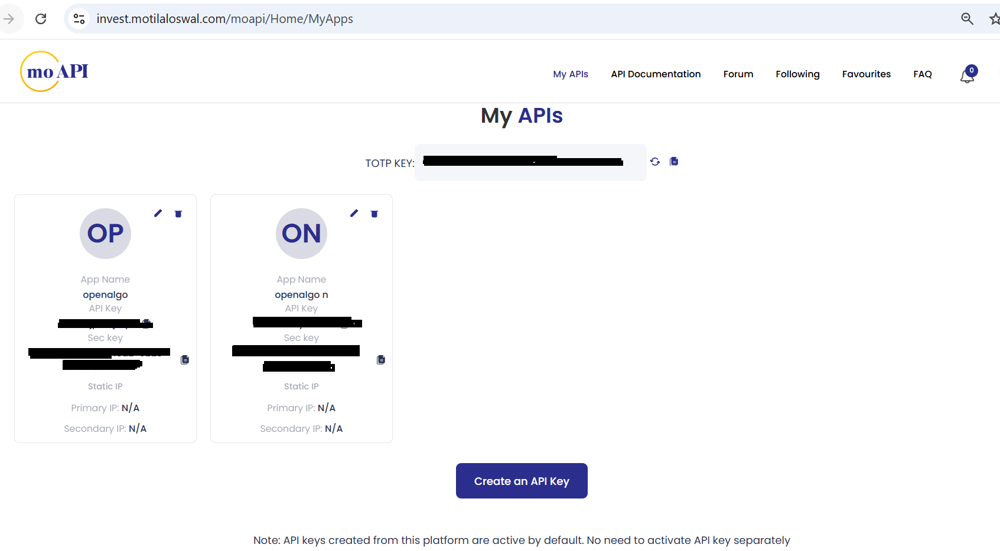
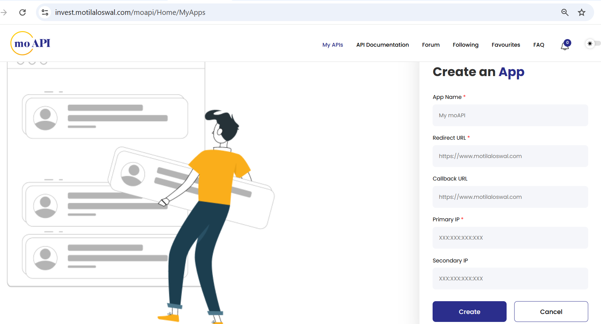

# Motilal Oswal

Motilal Oswal Financial Services Limited (MOFSL) is one of India's leading financial services companies, offering a comprehensive suite of investment and trading services. Their API platform provides developers and algo traders with programmatic access to trading capabilities including order placement, portfolio management, and market data.

OpenAlgo seamlessly integrates with Motilal Oswal's API, enabling you to execute automated trading strategies across equity, derivatives, currency, and commodity segments.

### **Getting API Credentials**

#### **Step 1: Access the API Portal**

Visit the Motilal Oswal OpenAPI registration portal:

[https://invest.motilaloswal.com/moAPI/](https://invest.motilaloswal.com/moAPI/)

#### **Step 2: Register Your Application**

1. Log in with your Motilal Oswal trading credentials

<figure><figcaption></figcaption></figure>

<figure><figcaption></figcaption></figure>

2. Navigate to **My APIs**

<figure><figcaption></figcaption></figure>

3. Set Up TOTP - Copy the 32-character secret key and Add this key to your preferred authenticator app
4. Click on **Create on API Key**

<figure><figcaption></figcaption></figure>

5. Fill in the required details:

* **App Name:** Your application name (e.g., "OpenAlgo Trading")
* **Redirect URL:** `http://127.0.0.1:5000/motilal/callback`

6. Submit the registration

#### **Step 3: Obtain Your API Key**

* Your trading account number or Client Code will be your API Key.
* Copy the API Key generated and use as your API Secret

#### **Configuration**

&#x20;Set up your environment variables in a `.env` file for motilal's :

```
# Motilal Oswal API Configuration
BROKER_API_KEY = 'your_client_code' #Use your client code as api key
BROKER_API_SECRET = 'your_api_key_here'  #Use your generated API Key as API secret in .env file
```

Integrating with M**otilal APIs** unlocks the ability to automate strategies, execute trades, and analyze data directly within your own infrastructure. When used with **OpenAlgo**, you can self-host and run your entire algo trading stack — with full control and zero vendor lock-in.
