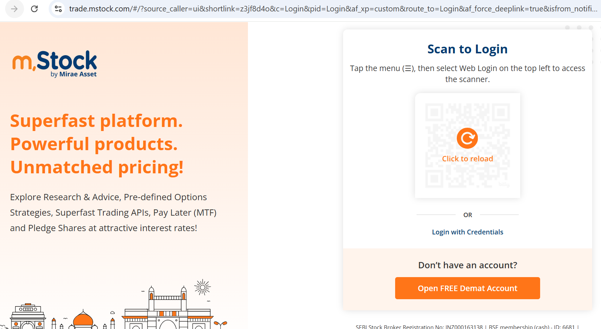
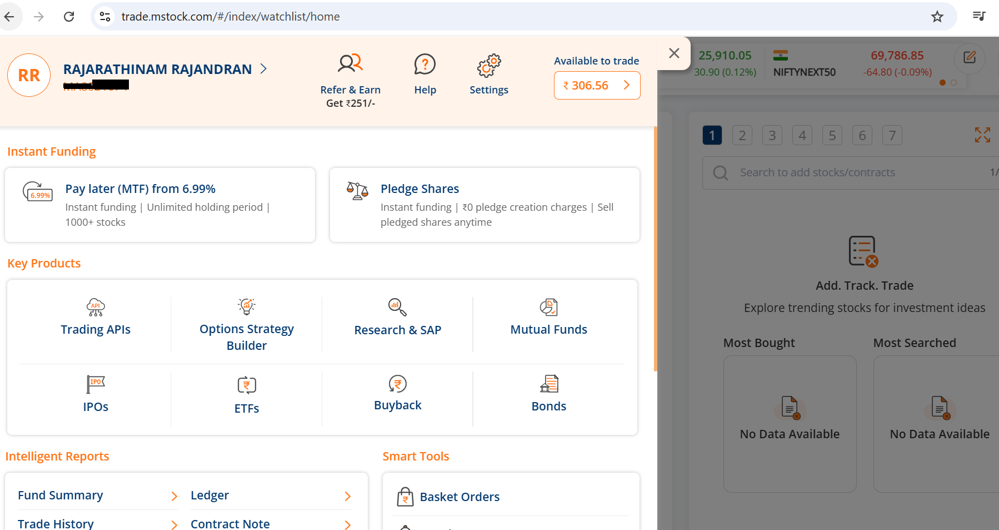
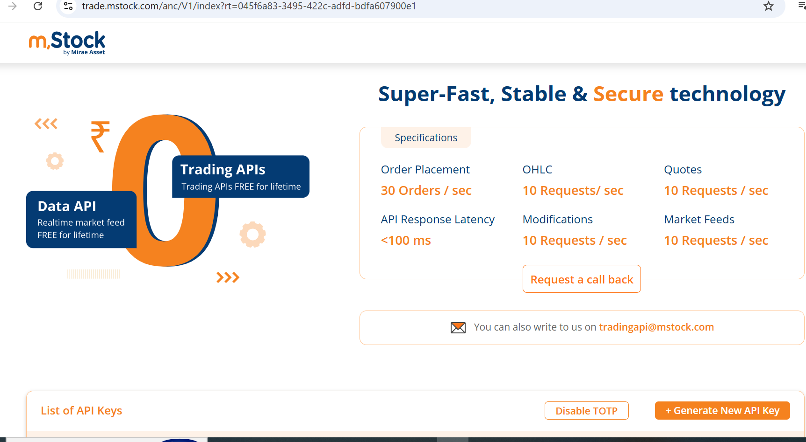
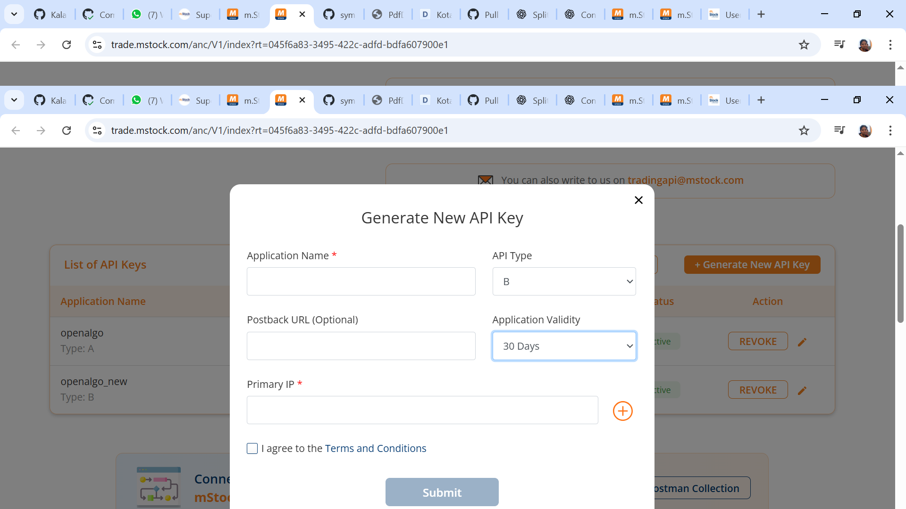

# Mstock

MStock is a modern Indian stock broker by Mirae Asset, offering commission-free trading and robust REST-based APIs. These APIs enable traders and developers to automate trading, retrieve account information, and integrate market data seamlessly. By connecting mStock OpenAPI with OpenAlgo, algo traders can efficiently execute strategies, manage positions, and automate workflows.

For developers and algo traders looking to use the mStock Type-B API, the integration process involves the following steps:

### **Step-by-Step Integration**

#### **Step 1: Prepare Your Trading Credentials**

Ensure you have your mStock **Client Code** (Login ID) and **Trading Password** ready.

You will also need access to your registered mobile number/email for OTP verification unless TOTP is enabled.

#### **Step 2: Register for API Access**

mStock provides API access via its OpenAPI portal.

* Visit the API Key genration website:\
  [**https://www.mstock.com/trading-api**](https://www.mstock.com/trading-api)

<figure><figcaption></figcaption></figure>

* Log in using your trading account credentials.
* **Open Menu** - Click on the hamburger menu icon located at the top-left corner of the screen.

<figure><figcaption></figcaption></figure>

* **Navigate to Trading APIs** - In the menu, go to **Products** - Then click on **Trading APIs**

<figure><figcaption></figcaption></figure>

* Click **Generate New API Key** and give API Type as Type B.

<figure><figcaption></figcaption></figure>

* **Enable TOTP** - You will see an option labeled "Generate TOTP" - Click on it to begin the TOTP setup process
* Copy your API Key.

#### **Retrieve API Credentials:**

* Your trading account number or Client Code will be your API Key.
* Copy the API Key generated and use as your API Secret

#### Configuration: <a href="#configuration" id="configuration"></a>

Set up your environment variables in a `.env` file for mstock's API:

```
BROKER_API_KEY = 'your_mstock_unique_client_code'
BROKER_API_SECRET = 'your_mstock_api_key_generated'
REDIRECT_URL = 'http://127.0.0.1:5000/mstock/callback'
```

Integrating with **mstock APIs** unlocks the ability to automate strategies, execute trades, and analyze data directly within your own infrastructure. When used with **OpenAlgo**, you can self-host and run your entire algo trading stack — with full control and zero vendor lock-in.
