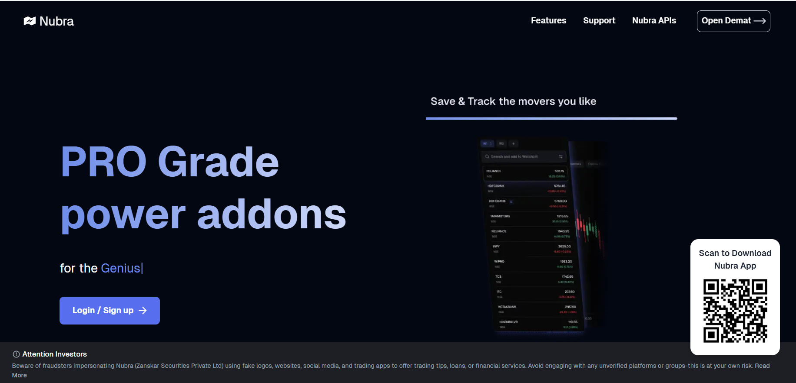
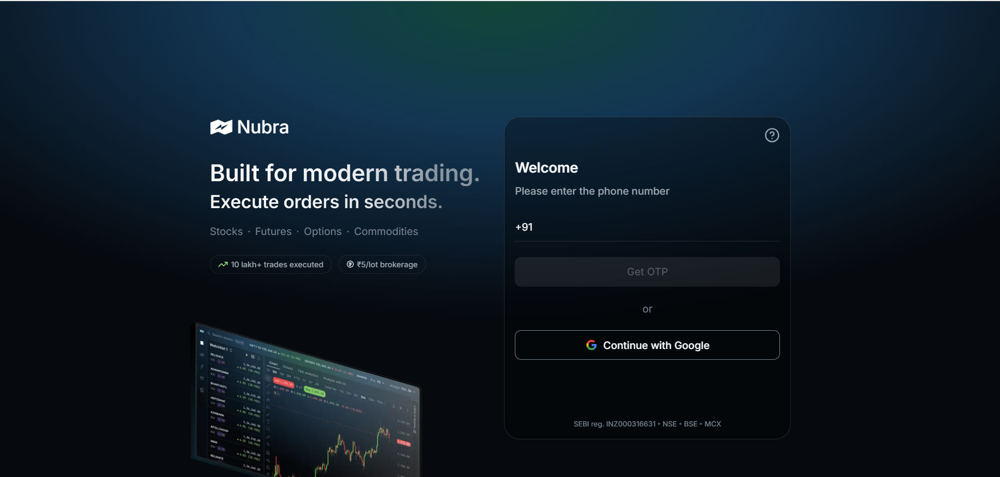
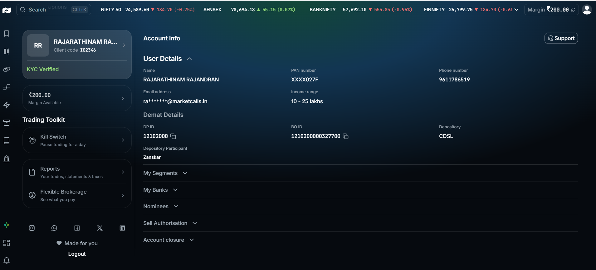
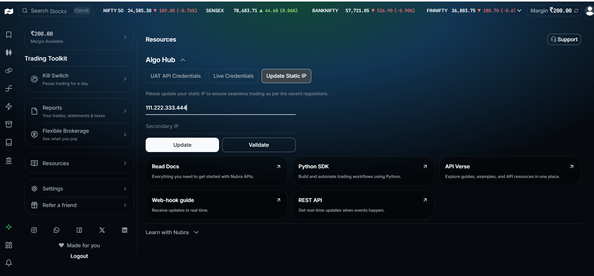

# Nubra

Nubra, by Zanskar Securities Private Limited, is a modern trading platform built for algorithmic and institutional traders. It provides REST-like resource-based endpoints with low-latency order execution, comprehensive market data access including quotes, Greeks, and historical candles, and secure MPIN-based authentication — making it an excellent choice for automated trading with OpenAlgo.

1. **Navigate** to the Nubra's Dashboard Login [https://nubra.io/](https://nubra.io/) Open Demat

<figure><figcaption></figcaption></figure>

2. All REST requests require:
   1. **API Key (client\_id)**
   2. **MPIN-based session (MPIN → session token)**

<figure><figcaption></figcaption></figure>

3. Click on the **Profile** icon located at the top-right corner of the page

<figure><figcaption></figcaption></figure>

<figure><figcaption></figcaption></figure>

3. To Register the static IP ,scroll down the left panel. Select **Resources-Update Static IP- Update - Validate**.

<figure><figcaption></figcaption></figure>

### **Environment Configuration**

Once your credentials are generated, configure them in your `.env` file:

```
BROKER_API_KEY = 'your_nubra_clientid'
BROKER_API_SECRET = 'your_nubra_mpin'
REDIRECT_URL = 'http://127.0.0.1:5000/nubra/callback'
```

Integrating with **Nubra APIs** unlocks the ability to automate strategies, execute trades, and analyze data directly within your own infrastructure. When used with **OpenAlgo**, you can self-host and run your entire algo trading stack — with full control and zero vendor lock-in.
