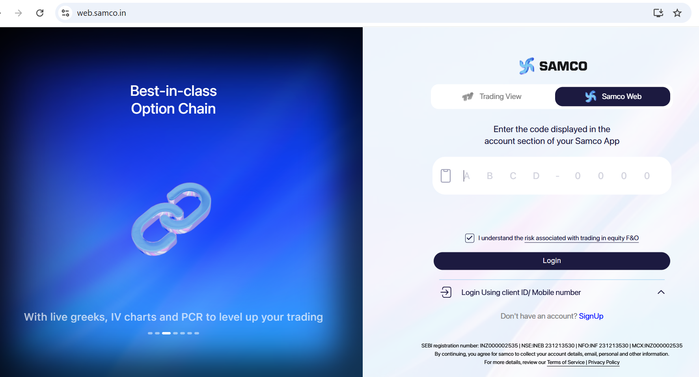
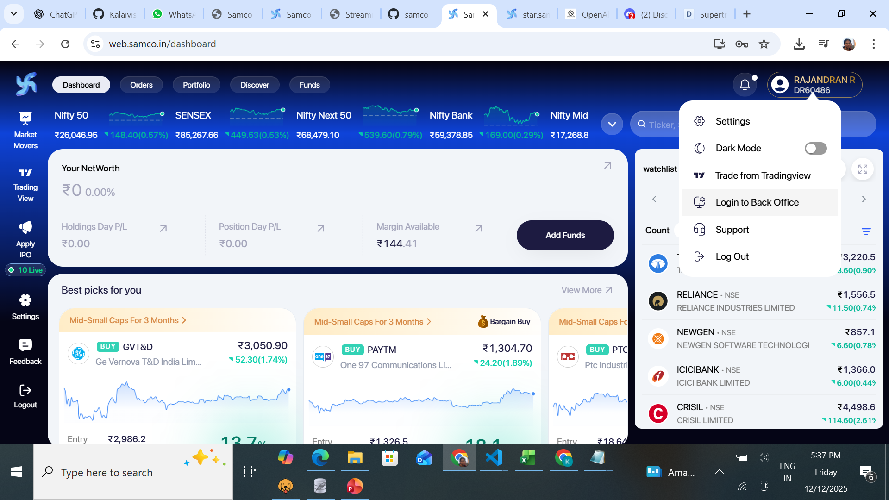
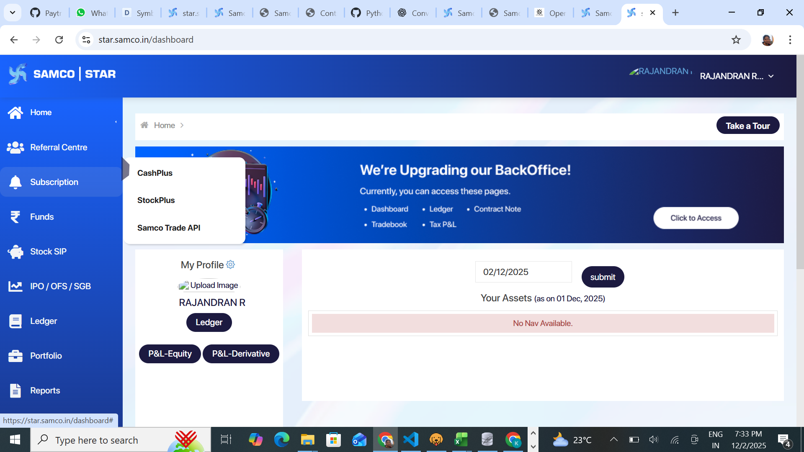
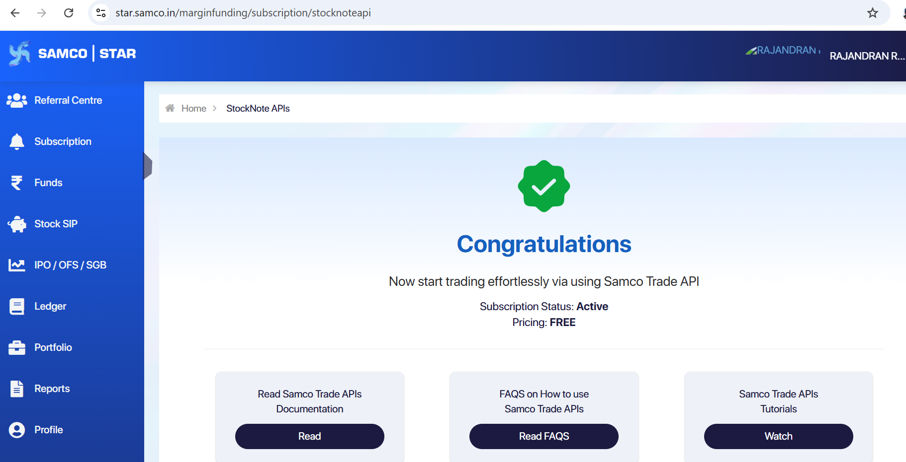

# Samco

Samco Securities is a leading discount broker in India offering equity, derivatives, commodity, and currency trading. Samco Trade API is a powerful RESTful API that allows traders to build customized trading applications, automate their strategies, and integrate with various algorithmic trading platforms.

### **Steps for Integration**

#### **Step 1: Login to Samco website**

Visit [https://web.samco.in/](https://web.samco.in/) and login with your client ID/Mobile number.

<figure><figcaption></figcaption></figure>

**Step 2: Navigate to Login to Back Office**

From the dashboard, navigate to the profile dropdown and then to Login to Back Office

<figure><figcaption></figcaption></figure>

#### **Step 3: Activate Trade API**

Navigate to subscription menu , Samco Trade API

<figure><figcaption></figcaption></figure>

Now activate your subscription

<figure><figcaption></figcaption></figure>

#### **Environment Configuration**

After activating Samco Trade API , configure your samco login crdentials in .env file

```
BROKER_API_KEY = 'your_samco_clientid'
BROKER_API_SECRET = 'your_samco_password'
REDIRECT_URL = 'http://127.0.0.1:5000/sao/callback'
```

Integrating with Samco **APIs** unlocks the ability to automate strategies, execute trades, and analyze data directly within your own infrastructure. When used with **OpenAlgo**, you can self-host and run your entire algo trading stack — with full control and zero vendor lock-in.
