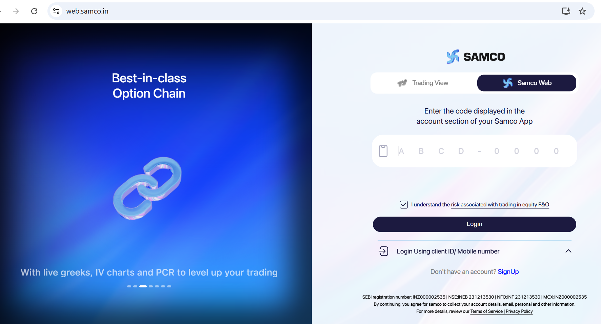
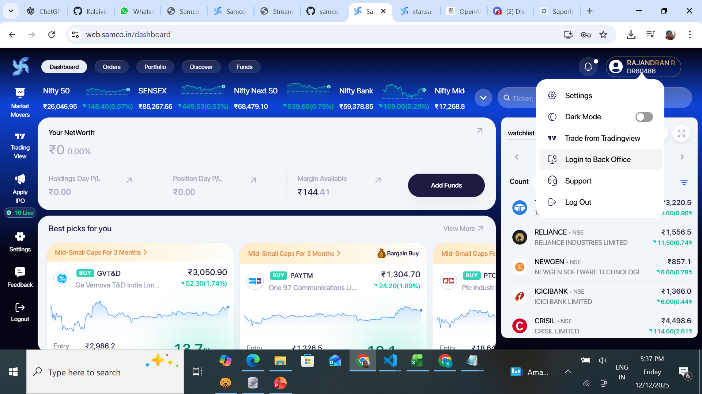
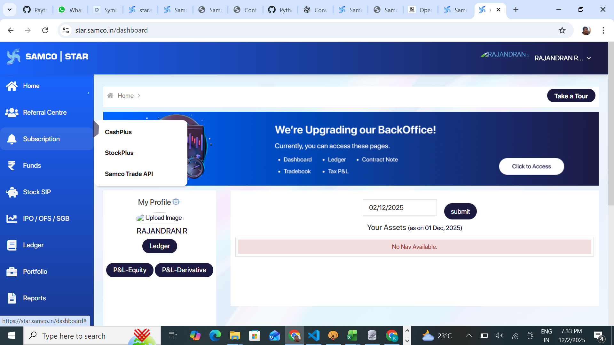
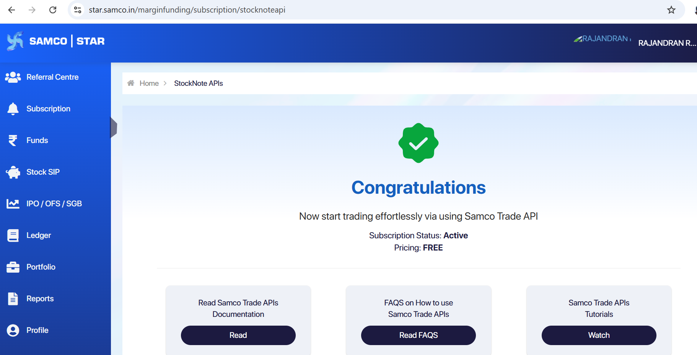
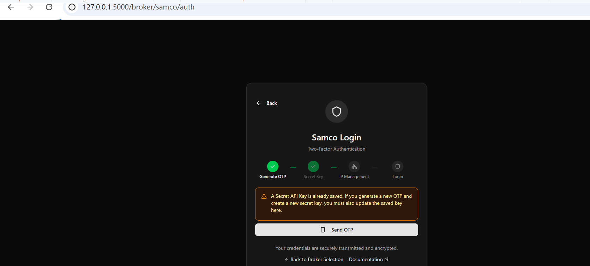
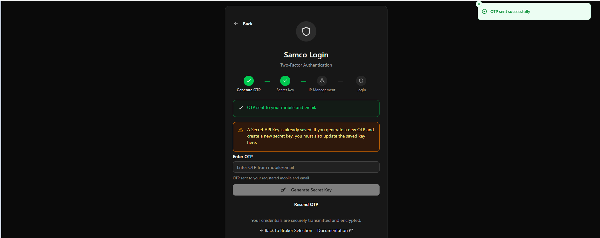
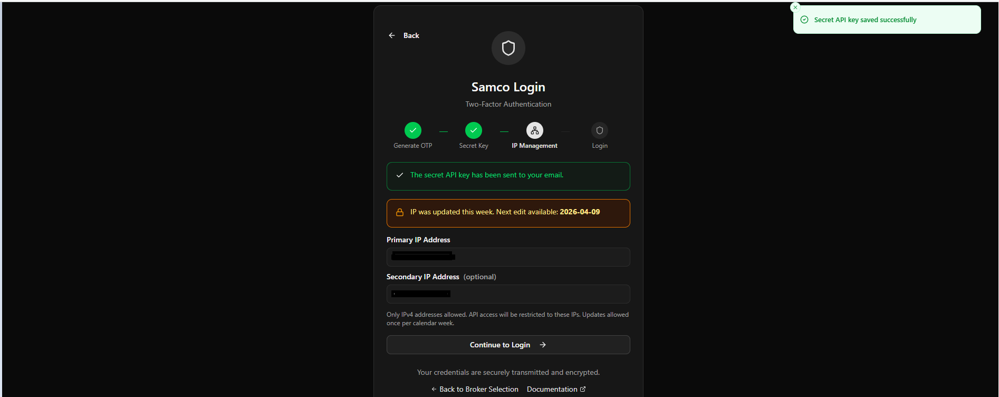

# Samco

Samco Securities is a leading discount broker in India offering equity, derivatives, commodity, and currency trading. Samco Trade API is a powerful RESTful API that allows traders to build customized trading applications, automate their strategies, and integrate with various algorithmic trading platforms.

### **Steps for Integration**

#### **Step 1: Login to Samco website**

Visit [https://web.samco.in/](https://web.samco.in/) and login with your client ID/Mobile number.

<figure><figcaption></figcaption></figure>

**Step 2: Navigate to Login to Back Office**

From the dashboard, navigate to the profile dropdown and then to Login to Back Office

<figure><figcaption></figcaption></figure>

#### **Step 3: Activate Trade API**

Navigate to subscription menu , Samco Trade API

<figure><figcaption></figcaption></figure>

Now activate your subscription

<figure><figcaption></figcaption></figure>

#### **Step 4 :** **Environment Configuration**

After activating Samco Trade API , configure your samco login crdentials in .env file

```
BROKER_API_KEY = 'your_samco_clientid'
BROKER_API_SECRET = 'your_samco_password'
REDIRECT_URL = 'http://127.0.0.1:5000/sao/callback'
```

#### Step 5 : Process of Static IP Whitelisting&#x20;

When you select Samco from the broker selection page, you will see a multi-step wizard with four steps:

<figure><figcaption></figcaption></figure>

**Step A : Generate OTP**

1. Click the Send OTP button
2. An OTP will be sent to your registered mobile number and email
3. Enter the OTP you received and click Generate Secret Key

**Note :**&#x49;f you have already completed the one-time setup before, this step will show a warning that a Secret API Key is already saved. You only need to repeat this step if you want to generate a new secret key.

**Step B : Save Secret API Key**

<figure><figcaption></figcaption></figure>

1. After entering the OTP, Samco will send a Secret API Key to your registered email
2. Open your email, copy the Secret API Key
3. Paste it in the input field and click Save Secret Key

<figure><figcaption></figcaption></figure>

**Important:** The Secret API Key never expires. Keep it secure and do not share it with anyone. You only need to do this step once. If you generate a new OTP and create a new secret key, you must update the saved key as well.

**Step 3: IP Management**

<figure><figcaption></figcaption></figure>

1. Enter your server's Primary IP Address (the static IP of the machine running OpenAlgo)
2. Optionally enter a Secondary IP Address as a backup
3. Click Register IP (or Update IP if already registered)
4. A confirmation dialog will appear before submitting&#x20;

**IP Update Restriction:** Samco allows IP changes only once per calendar week. If you have already updated your IP this week, the fields will be locked and a message will show the next available edit date. Make sure you enter the correct IP before confirming.

**Note:** Only IPv4 addresses are supported. After registration, Samco will reject API requests from any IP address that is not registered.

**Step D: Login**

<figure><figcaption></figcaption></figure>

1. Click Login to Samco
2. OpenAlgo will automatically generate an access token using your stored Secret API Key and log\
   you in
3. On success, you will be redirected to the Trading Dashboard

**Daily Login**

Once the one-time setup is complete (Steps 1-3), your daily login is simple:

1. Select Samco from the broker selection page
2. The wizard will skip directly to the IP Management step (showing your registered IPs)
3. Click Continue to Login, then click Login to Samco
4. You will be logged in and redirected to the dashboard

**Troubleshooting**

| Problem                                  | Solution                                                                                                                                                                     |
| ---------------------------------------- | ---------------------------------------------------------------------------------------------------------------------------------------------------------------------------- |
| OTP not received                         | Check your registered mobile and email. Wait a minute and try Resend OTP.                                                                                                    |
| Secret API Key email not received        | Check your spam/junk folder. The OTP and secret key use different not received email services. Wait a few minutes.                                                           |
| "Secret key does not match"              | The saved key may be incorrect. Go to Step 1, generate a new OTP, match" get a fresh secret key from email, and save it again.                                               |
| "The IP is not the registered static IP" | Your server's public IP does not match what is registered with registered static IP" Samco. Check your server's IP and update it in Step 3 (if the weekly lock has expired). |
| IP fields are locked                     | IPs can only be updated once per calendar week. Wait until the date shown in the warning message.                                                                            |
| "Failed to save secret API key"          | Make sure you are logged into OpenAlgo first (via the login page) before starting the Samco auth wizard.                                                                     |

Integrating with Samco **APIs** unlocks the ability to automate strategies, execute trades, and analyze data directly within your own infrastructure. When used with **OpenAlgo**, you can self-host and run your entire algo trading stack — with full control and zero vendor lock-in.
