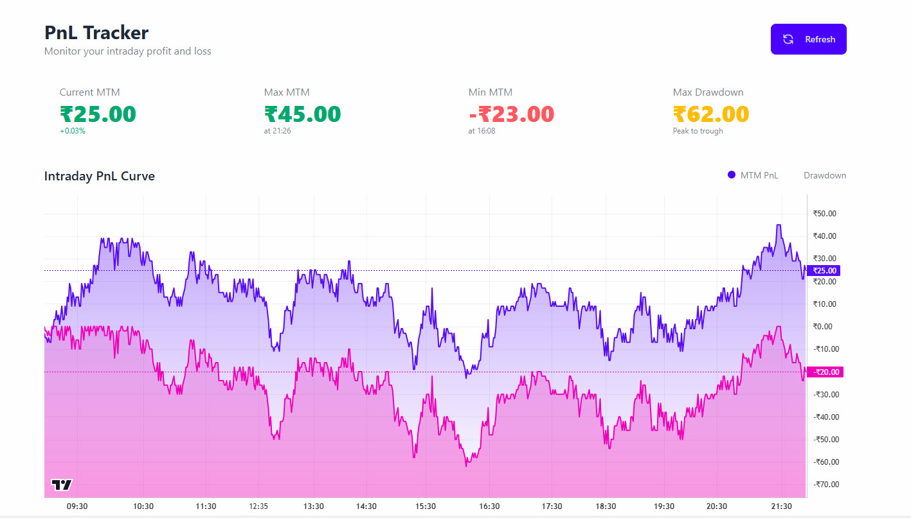

# PNL Tracker

### Overview

The PnL Tracker is a real-time profit and loss monitoring feature in OpenAlgo that provides visual insights into intraday trading performance. It displays MTM (Mark-to-Market) PnL curves and drawdown analysis using interactive charts powered by TradingView Lightweight Charts.

<figure><figcaption></figcaption></figure>

## PnL Tracker Documentation

### Overview

The PnL Tracker is a real-time profit and loss monitoring feature in OpenAlgo that provides visual insights into intraday trading performance. It displays MTM (Mark-to-Market) PnL curves and drawdown analysis using interactive charts powered by TradingView Lightweight Charts.

### Features

#### Key Metrics

* **Current MTM**: Real-time mark-to-market profit/loss
* **Max MTM**: Peak profit achieved during the trading day with timestamp
* **Min MTM**: Maximum loss during the trading day with timestamp
* **Max Drawdown**: Largest peak-to-trough decline in portfolio value

#### Visualization

* Interactive intraday PnL curve from 9:00 AM IST to current time
* Drawdown visualization showing portfolio decline from peaks
* IST timezone support with accurate time display
* Theme-aware charts (Light/Dark/Garden themes)

### Technical Architecture

#### Components

**1. Blueprint Route (`/blueprints/pnltracker.py`)**

* **Endpoint**: `/pnltracker` - Main page
* **API Endpoint**: `/pnltracker/api/pnl` - Data API (POST)
* **Session Management**: Uses `check_session_validity` decorator
* **Authentication**: API key based authentication via `get_api_key_for_tradingview()`

**2. Frontend (`/templates/pnltracker.html`)**

* TradingView Lightweight Charts v5.0.8 for visualization
* DaisyUI components for UI
* Manual refresh control (no auto-refresh)
* Responsive design with mobile support

#### Data Flow

```
1. User clicks PnL Tracker in navbar
   ↓
2. Frontend loads and requests PnL data
   ↓
3. Backend fetches:
   - Tradebook (executed trades) 
   - Current positions
   - Historical 1-minute data
   ↓
4. Calculate MTM PnL:
   - For trades: (current_price - executed_price) × quantity
   - For positions: (current_price - average_price) × quantity
   ↓
5. Generate time series data from 9 AM IST
   ↓
6. Return formatted data to frontend
   ↓
7. Display interactive charts
```

### PnL Calculation Logic

#### For Executed Trades

```python
# For each trade in tradebook:
if action == 'BUY':
    pnl = (current_price - executed_price) × quantity
else:  # SELL
    pnl = (executed_price - current_price) × quantity
```

#### For Open Positions (No Trades)

```python
# When tradebook is empty but positions exist:
if quantity > 0:  # Long position
    pnl = (current_price - average_price) × quantity
else:  # Short position
    pnl = (average_price - current_price) × abs(quantity)
```

#### Portfolio MTM

* Individual symbol PnLs are combined into portfolio PnL
* Time-synchronized data using pandas DataFrame joins
* Forward-fill missing data points for continuity

### Timestamp Handling

The system robustly handles different timestamp formats from various brokers:

1. **Unix timestamp (seconds)**: Most common format
2. **Unix timestamp (milliseconds)**: Alternative format
3. **String datetime**: ISO format strings
4. **Timezone handling**: Automatic conversion to IST


### Error Handling

#### Graceful Degradation

* **Missing historical data**: Shows flat PnL line at current value
* **Invalid timestamps**: Falls back to default time range
* **String numeric values**: Automatically converts to float
* **Empty tradebook**: Uses position data if available
* **No data**: Returns zero PnL metrics

#### Logging

* Comprehensive logging at INFO, WARNING, and ERROR levels
* Detailed error messages for debugging
* Performance metrics logging


### Time Filtering

* **Start Time**: 9:00 AM IST (market open)
* **End Time**: Current time
* **Frequency**: 1-minute intervals
* **Timezone**: Asia/Kolkata (IST)


### Performance Optimization

#### Manual Refresh Only

* No automatic refresh to reduce server load
* User-initiated refresh via button click
* Prevents unnecessary API calls

#### Data Batching

* Single API call fetches all required data
* Parallel processing of multiple symbols
* Efficient pandas operations for calculations

#### Caching Strategy

* Session-based authentication caching
* Reuses auth tokens within session
* Minimizes database queries

### Broker Compatibility

#### Supported Features by Broker

* All brokers supporting tradebook API
* All brokers supporting 1-minute historical data
* Position tracking across all integrated brokers

#### Special Cases

* **MCX/Commodities**: Special quantity calculation when trade\_value equals average\_price (1 lot)
* **Different timestamp formats**: Automatic detection and conversion
* **Missing data fields**: Graceful fallback to defaults

### Usage

#### Accessing PnL Tracker

1. Login to OpenAlgo
2. Click profile menu in navbar
3. Select "PnL Tracker" (below "Logs")
4. View real-time PnL metrics and charts
5. Click "Refresh" button to update data

#### Understanding the Display

* **Green values**: Profit positions
* **Red values**: Loss positions
* **Purple line**: MTM PnL curve
* **Pink area**: Drawdown from peak

### Troubleshooting

#### Common Issues

1. **"No data in TradeBook"**
   * Normal when no trades executed
   * Position PnL will still be displayed if positions exist
2. **Timestamps showing wrong time**
   * Automatic IST conversion handles this
   * Check broker's timestamp format if persistent
3. **Zero values displayed**
   * Verify API key is configured
   * Check if market is open (after 9 AM IST)
   * Ensure positions or trades exist
4. **Chart not loading**
   * Verify lightweight-charts.js is loaded
   * Check browser console for errors
   * Try different theme or refresh page

####
